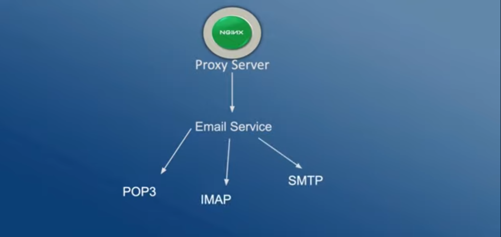
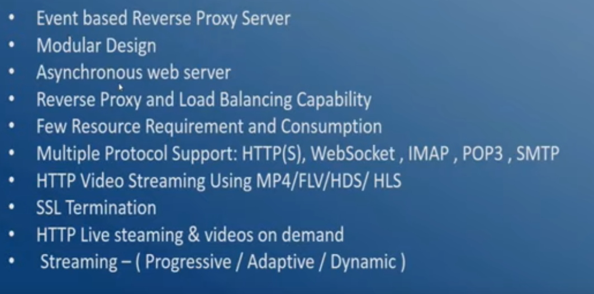
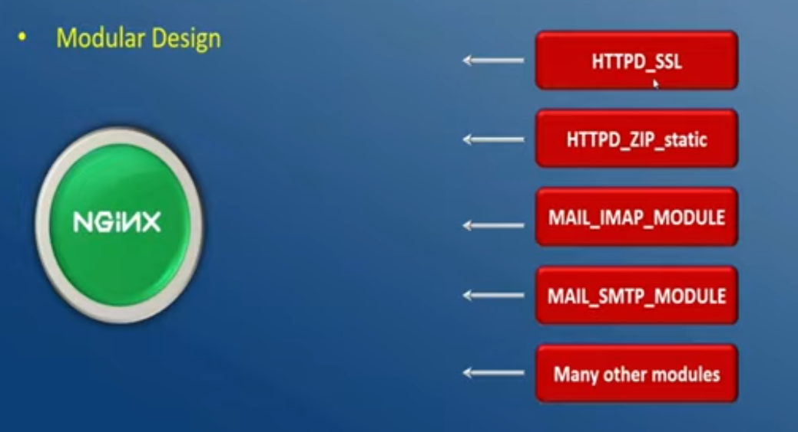
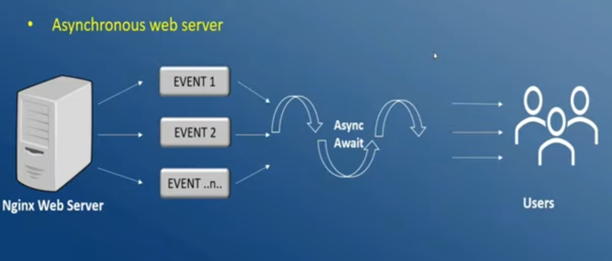
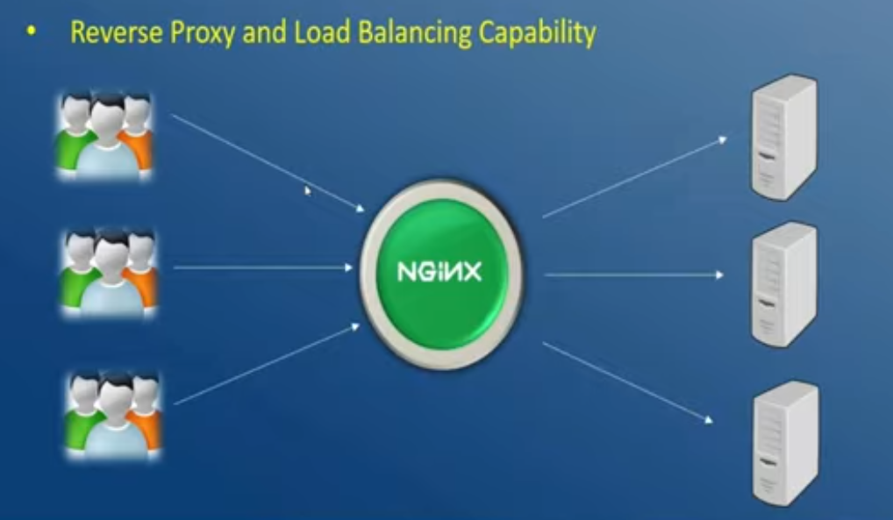
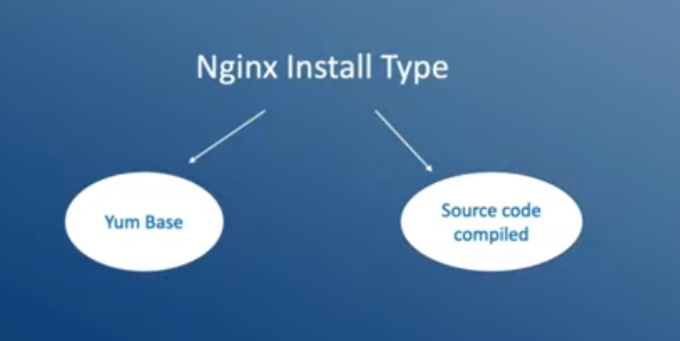
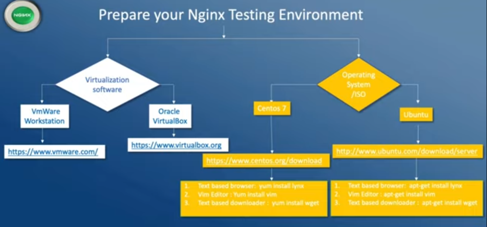
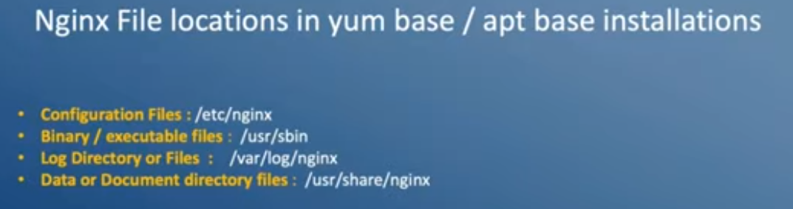
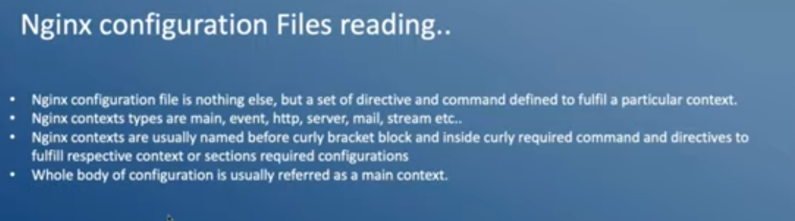
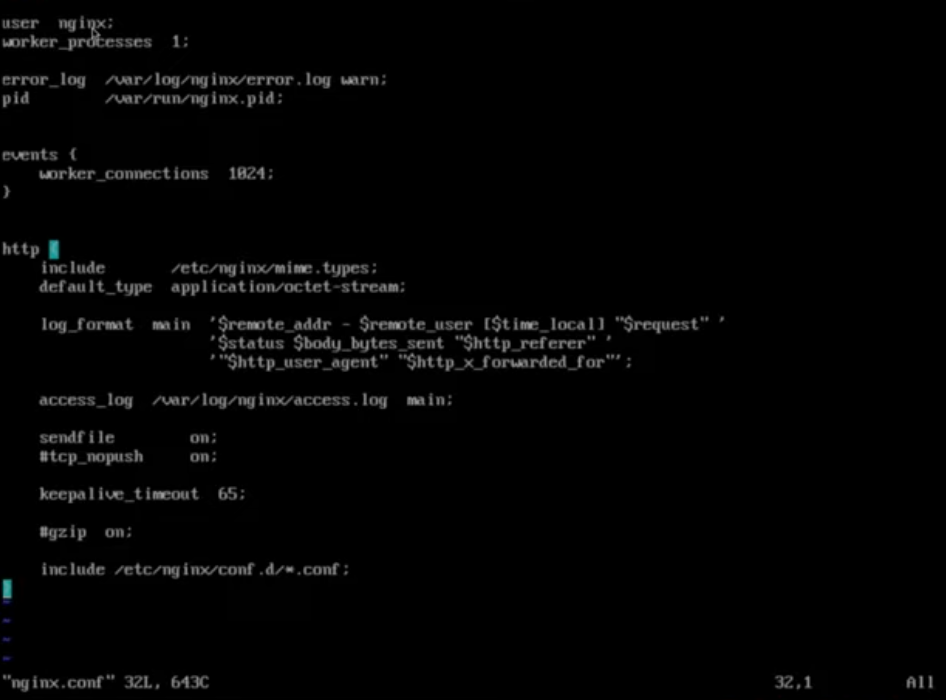

# Nginx-Complete
Documenting my Nginx Learning

### Links 
1. Youtube : https://www.youtube.com/watch?v=D5grhfkjjXE




1. What is a web server ? 
    - takes request from the client ( browser ) and server responds/delivers the contents.

2. Why consider Nginx ? 
    - Its fast 
    - It can accelerate your web application
    - It has a straightforward load balancer 
    - It scales well ( thousands of requests can get served and even more, increasing load is handled )
    -  Upgrade on fly ( reconfiguring nginx without affecting the application activity )
    - It's affordable to install and easy to use 

3. Features of Nginx 


    - Event based reverse Proxy server : 
    

    - Modular Design
    

    builtin modules can be included. There are over 62 builtin modules 

    - Asynchronous Web server 
    
    Nginx is first a reverse proxy and then a web server
    - Reverse Proxy and Load balancing capability :
    Does not look at the file system and looks at the urls and makes the decision based on it 
    

    - SSL Termination 
    - Few resource requirement and consumption : requires less memeory, CPU cycles
    - Multiple protocols supported : Http(s) , Websocket , IMAP , POP3 , SMTP
    - Http video streaming using mp4/flv/hds/hls : the video is not downloaded in one shot, and the contents is sent in small packets and streamed. Also supports streaming

4. Installation of Nginx 



5. apt based installation of Nginx ( on Ubuntu 20.04 )
    - ```sudo apt install lynx```
    - starting the server : ```systemctl start nginx```
    - viewning the status : ```systemctl status nginx ```
    - stopping the server : ```systemctl stop nginx```
    
    - start the server : ```systemctl start nginx```
    - type to visit localhost on the terminal : ```lynx http://localhost/```
    - get your ip address : ```ip addr```
    - visit the ip address on your browser 
    - you can see the page 
    


6. Directory Structure of Nginx Application


    - file locations : ```cd /etc/nginx```
    - log file locations : ```cd var/log/nginx```
    - executable file locations : ```cd /usr/sbin/nginx```
    - document locations ( html files etc ) : ```cd /usr/share/nginx```
    - tarball locations ( for tarball based installation only ): ```cd /APPS/nginx/```
    - nginx.conf file is present in : ```cd /etc/nginx```
    
7. Nginx configurations file reading 


    - user nginx : with which user processor you want to run the process 
    - worker_processes : number of worker processes 
    - the worker_processes is defined by the number of cores in your hardware 
    - error_log : the location of the error logs file
    - warn : the level of error to be stored 
    - pid : process id
    - get the pid of the nginx server : cat /var/run/nginx.pid
    - terminal : ps aux | grep -i nginx   -> this will show the details of the process
    - events : worker_connection is a parameter 
    - the 1824 is the maximum number of requests it can handle
    - http : 
        - include : cd /etc/nginx/mime.types   -> contains all the supporting files
        - default_type : octect_stream
        - log_format : the log format for access log and not error log 
        - access log : the location of the access log
        - http_user_agent : the browser used by the user 
        - sendfile : on -> sending file is enabled 
        - tcp_nopush : on -> by default is on 
        - keepalive_timeout : 65 -> keeps the connection alive for 65s 
        - gzip : on 
        - include /etc/nginx/conf.d/*.conf  -> all .conf ( configuration files, has server contacts etc and other configuration information )

